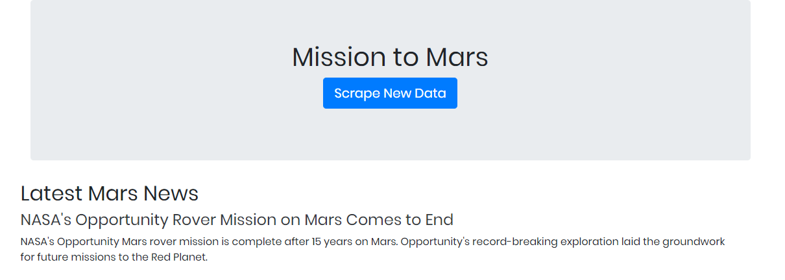
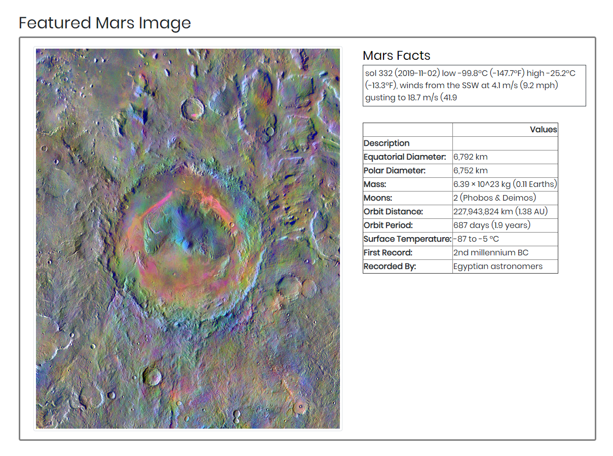
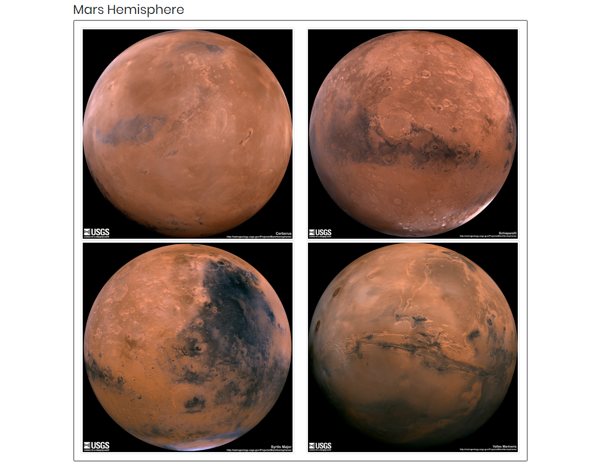

# MISSION TO MARS

App is using chrome web-driver and MongoDB Atlas database, successfully deployed to Heroku.

Below are the steps:

The goal is to build a web application that scrapes various websites for data related to the Mission to Mars and displays the information in a single HTML page.

### NASA Mars News

* Scrape the [NASA Mars News Site](https://mars.nasa.gov/news/) and collect the latest News Title and Paragragh Text. Assign the text to variables that you can reference later.

```python
# Example:
latest_news_title = "10/17/2019 10:53:05 PM 10/17/2019 10:53:05 PM "

latest_news_header = "NASA's Opportunity Mars rover mission is complete after 15 years on Mars. Opportunity's record-breaking exploration laid the groundwork for future missions to the Red Planet."
```

### JPL Mars Space Images - Featured Image

* Visit the url for JPL's Featured Space Image [here](https://www.jpl.nasa.gov/spaceimages/?search=&category=Mars).

* Use splinter to navigate the site and find the image url for the current Featured Mars Image and assign the url string to a variable called `featured_img_address["Address"] `.

* Make sure to find the image url to the full size `.jpg` image.

* Make sure to save a complete url string for this image.

```python
# Example:
featured_img_address["Address"]  = 'https://www.jpl.nasa.gov/spaceimages/images/largesize/PIA16225_hires.jpg'
```

### Mars Weather

* Visit the Mars Weather twitter account [here](https://twitter.com/marswxreport?lang=en) and scrape the latest Mars weather tweet from the page. Save the tweet text for the weather report as a variable called `mars_weather`.

```python
# Example:
weather["info"] = 'sol 314 (2019-10-15) low -102.8ºC (-153.0ºF) high -24.8ºC (-12.6ºF), winds from the SSE at 4.9 m/s (11.1 mph) gusting to 19.7 m/s (44.0 mph), pressure at 7.20 hPa 5:51 PM · Oct 14, 2019'
```

### Mars Facts

* Visit the Mars Facts webpage [here](http://space-facts.com/mars/) and use Pandas to scrape the table containing facts about the planet including Diameter, Mass, etc.

* Use Pandas to convert the data to a HTML table string.

### Mars Hemisperes

* Visit the USGS Astrogeology site [here](https://astrogeology.usgs.gov/search/results?q=hemisphere+enhanced&k1=target&v1=Mars) to obtain high resolution images for each of Mar's hemispheres.

* You will need to click each of the links to the hemispheres in order to find the image url to the full resolution image.

* Save both the image url string for the full resolution hemipshere image, and the Hemisphere title containing the hemisphere name. Use a Python dictionary to store the data using the keys `img_url` and `title`.

* Append the dictionary with the image url string and the hemisphere title to a list. This list will contain one dictionary for each hemisphere.

```python
# Example:
hemisphere_image_urls = [
    {"title": "Valles Marineris Hemisphere", "img_url": "..."},
    {"title": "Cerberus Hemisphere", "img_url": "..."},
    {"title": "Schiaparelli Hemisphere", "img_url": "..."},
    {"title": "Syrtis Major Hemisphere", "img_url": "..."},
]
```

---

## Step 2 - MongoDB and Flask Application

Use MongoDB with Flask templating to create a new HTML page that displays all of the information that was scraped from the URLs above.

* Start by converting your Jupyter notebook into a Python script called `scrapemars.py` with a function called `scrape` that will execute all of your scraping code from above and return one Python dictionary containing all of the scraped data.

* Next, create a route called `/scrape` that will import your `scrapemars.py` script and call your `scrape` function.

  * Store the return value in MongoDB as a Python dictionary.

* Create a root route `/` that will query your Mongo database and pass the mars data into an HTML template to display the data.
* 
* 
* 



